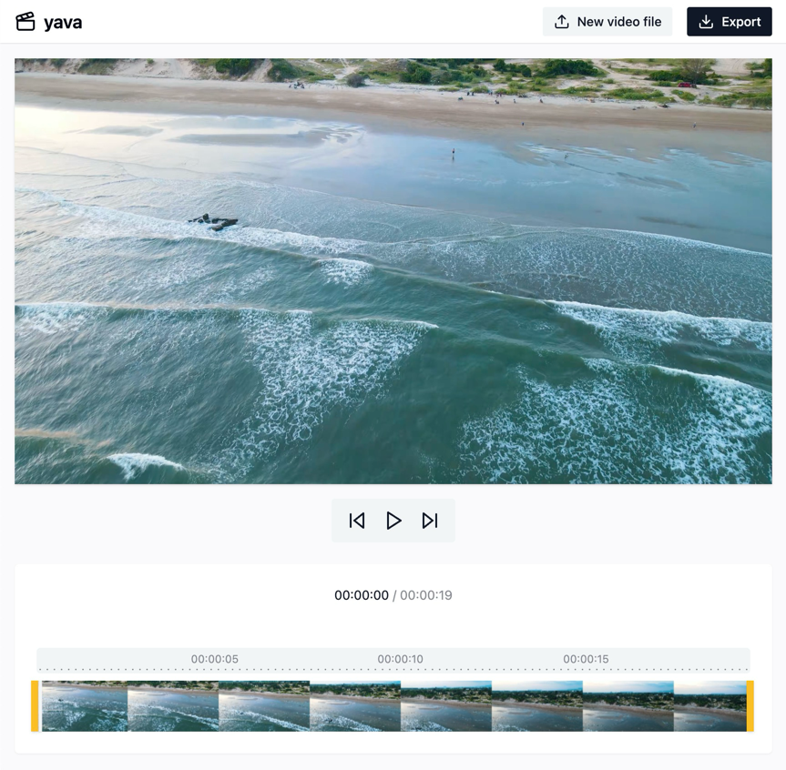

# yava (yet another video app)

yava is a web app that lets you edit video files, as well as record videos with your camera and capture your screen. It uses a [wasm port](https://github.com/ffmpegwasm/ffmpeg.wasm) of the amazing [FFmpeg](https://www.ffmpeg.org/) to process video files in your browser, no upload needed.

Check it out: [yetanothervideo.app](yetanothervideo.app)

## Features

* Import video files from your file system
* Record video streams from your camera
* Capture a windows and screens (if your device supports it)
* Trim, cut, crop and resize.
* Lossless conversion to mp4
* Export as a gif 

## Contribution
Pull requests, bug reports and feature requests are welcome.

## Author
Vinicius De Antoni - [vdeantoni.com](vdeantoni.com)