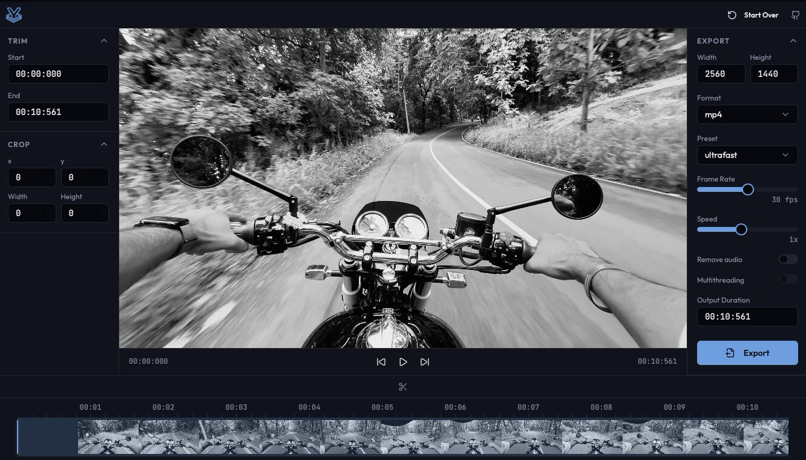

# yava (yet another video app)

yava is a web app for editing video in the browser. Load a file, record your camera or capture your screen, then trim, slice, crop, resize and export. It runs a [wasm port](https://github.com/ffmpegwasm/ffmpeg.wasm) of the amazing [FFmpeg](https://www.ffmpeg.org/), so nothing is ever uploaded and your files stay on your device.

Check it out: [yava.video](https://www.yava.video)



## Features

- Load video by picking a file, dragging it in, pasting a file or a URL, or linking straight to one with `?v=<url>`
- Record from your camera, with device selection
- Capture a window or a whole screen, where the browser supports it
- Trim the start and end
- Slice the timeline into segments, then delete, join, drag or resize them
- Crop and resize
- Change speed or frame rate, or drop the audio
- Export to MP4, MOV, WebM or GIF
- Share an edit as a link. The whole edit state travels in the URL hash, so the recipient opens the same cuts and settings

## Running it locally

```bash
pnpm install
pnpm dev        # https://localhost:3000
```

The dev server uses a self-signed certificate, so your browser will warn you the first time.

FFmpeg's multithreaded build needs `SharedArrayBuffer`, which needs the `Cross-Origin-Opener-Policy` and `Cross-Origin-Embedder-Policy` headers. `vite.config.ts` sets them for local development and `vercel.json` sets them in production. Without them yava still works, just on the slower single-threaded core.

| Command          | What it does                          |
| ---------------- | ------------------------------------- |
| `pnpm build`     | Type-check, then build for production |
| `pnpm check`     | Type-check, Prettier and ESLint       |
| `pnpm format`    | Format everything with Prettier       |
| `pnpm test`      | Unit, component and end-to-end tests  |
| `pnpm test:unit` | Vitest only                           |
| `pnpm test:ct`   | Playwright component tests only       |
| `pnpm test:e2e`  | Playwright end-to-end tests only      |

## Contribution

Pull requests, bug reports and feature requests are welcome.

## Author

Vinicius De Antoni - [vdeantoni.com](https://vdeantoni.com)

## License

[MIT](LICENSE)
